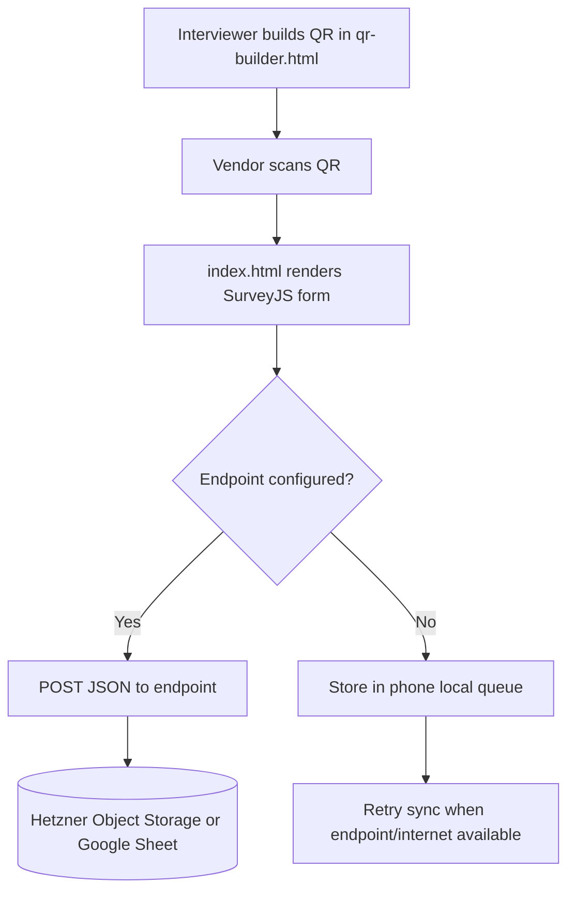

# Nirmi Vendor Intake

QR-first vendor survey for field research in Nepal.

- Vendor survey: [index.html](index.html) — i18n (Nepali / Hindi / English), progress tracking, offline queue
- QR builder: [qr-builder.html](qr-builder.html) — session config embedded in QR link

## Product intent

The QR is shown by interviewer.

The vendor scans and opens a simple phone form.

The setup context is embedded in QR, so vendor does not see setup controls.

## QR embedded setup

The QR carries one `cfg` parameter.

Decoded config fields:

- `sid`: session id
- `area`: location name
- `iv`: interviewer name
- `ep`: storage endpoint url
- `lang`: language hint

Example final URL shape:

```text
https://MikeOfZen.github.io/nirmi-survey/index.html?cfg=BASE64URL_ENCODED_JSON
```

## Architecture



## Why this is robust and simple

- SurveyJS handles mobile questionnaire UX.
- Static hosting on GitHub Pages keeps deployment simple.
- Endpoint is configurable per QR session.
- Failed submissions are queued locally and retried.
- Full payload backup can be copied from result screen.

## Storage backend

The survey POSTs JSON to whatever endpoint URL is embedded in the QR.
Backend code lives in the private [nirmi-business](https://github.com/MikeOfZen/nirmi-business) repo.

## GitHub Pages

Served from branch `main`, root folder.

Live at: <https://MikeOfZen.github.io/nirmi-survey/>

## Payload format

Vendor page sends payload like this:

```json
{
  "submissionId": "AB12CD34",
  "submittedAt": "2026-04-16T12:30:00.000Z",
  "context": {
    "sessionId": "SAT-2026-04-16-AM",
    "area": "Satungal",
    "interviewer": "Mike",
    "lang": "en"
  },
  "answers": {
    "vendor_type": "Vegetables",
    "customers_band": "41-70",
    "revenue_band": "4001-7000"
  },
  "computed": {
    "customersPerShift": 55,
    "revenuePerShiftNpr": 5500,
    "costPerShiftNpr": 3200,
    "netPerShiftNpr": 2300,
    "marginPct": 42
  }
}
```
